# 🏥 Health Management Platform - ERD (Entity Relationship Diagram)

## Mermaid ERD (도메인별 색상 구분)

```mermaid
erDiagram
    %% ================================
    %% 🔵 User Domain (파란색)
    %% ================================
    USER {
        bigint id PK
        varchar userId UK "로그인 ID"
        varchar email UK "이메일"
        varchar password "비밀번호(암호화)"
        varchar realName "실명"
        varchar role "MEMBER|ADMIN|DOCTOR"
        date birthDate "생년월일"
        varchar gender "MALE|FEMALE|OTHER"
        varchar phoneNumber "연락처"
        varchar department "부서"
        double height "키(cm)"
        double weight "몸무게(kg)"
        timestamp createdAt
        timestamp updatedAt
    }

    USER_OAUTH {
        bigint id PK
        bigint userId FK "User ID"
        varchar provider "GOOGLE|NAVER|KAKAO"
        varchar providerId "OAuth 제공자 ID"
        varchar email "OAuth 이메일"
        timestamp connectedAt "연동 시각"
        timestamp updatedAt
    }

    DOCTOR_PROFILE {
        bigint id PK
        bigint userId FK "User ID (UNIQUE)"
        varchar specialty "전공(가정의학과 등)"
        varchar licenseNumber "의사 면허번호"
        int medicalExperience "경력(년)"
        varchar education "학력"
        text introduction "소개"
        boolean isAvailable "진료 가능 여부"
        timestamp createdAt
        timestamp updatedAt
    }

    USER_PENALTY {
        bigint id PK
        bigint userId FK "User ID"
        varchar type "WARNING|SUSPENSION|BAN"
        text reason "제재 사유"
        timestamp startDate "시작일"
        timestamp endDate "종료일"
        boolean isActive "활성 여부"
    }

    %% ================================
    %% 🟢 Feed Domain (초록색)
    %% ================================
    FEED {
        bigint id PK
        bigint authorId FK "작성자 User ID"
        text content "피드 내용"
        varchar workoutType "RUNNING|SWIMMING|CYCLING|GYM|YOGA|ETC"
        int duration "운동 시간(분)"
        double distance "거리(km)"
        int calories "칼로리 소모"
        boolean isPublic "공개 여부"
        timestamp createdAt
        timestamp updatedAt
    }

    FEED_IMAGE {
        bigint id PK
        bigint feedId FK "Feed ID"
        varchar imageUrl "이미지 URL"
        varchar originalFilename "원본 파일명"
        bigint fileSize "파일 크기(bytes)"
        int displayOrder "표시 순서"
        timestamp uploadedAt
    }

    FEED_LIKE {
        bigint id PK
        bigint feedId FK "Feed ID"
        bigint userId FK "좋아요한 User ID"
        timestamp createdAt
        unique feedId_userId "복합 유니크 키"
    }

    COMMENT {
        bigint id PK
        bigint feedId FK "Feed ID"
        bigint authorId FK "작성자 User ID"
        text content "댓글 내용"
        timestamp createdAt
        timestamp updatedAt
    }

    COMMENT_LIKE {
        bigint id PK
        bigint commentId FK "Comment ID"
        bigint userId FK "좋아요한 User ID"
        timestamp createdAt
        unique commentId_userId "복합 유니크 키"
    }

    %% ================================
    %% 🔴 Medical Domain (빨간색)
    %% ================================
    APPOINTMENT {
        bigint id PK
        bigint patientId FK "환자 User ID"
        bigint doctorId FK "의사 User ID"
        timestamp appointmentDate "예약 일시"
        varchar type "CONSULTATION|CHECKUP|FOLLOWUP"
        varchar status "SCHEDULED|CONFIRMED|COMPLETED|CANCELLED"
        text symptoms "증상"
        text notes "메모"
        timestamp createdAt
        timestamp updatedAt
    }

    PRESCRIPTION {
        bigint id PK
        bigint appointmentId FK "Appointment ID (UNIQUE)"
        bigint doctorId FK "처방 의사 User ID"
        bigint patientId FK "환자 User ID"
        text diagnosis "진단명"
        text notes "처방 메모"
        timestamp prescribedAt "처방 일시"
        timestamp createdAt
    }

    PRESCRIPTION_MED {
        bigint id PK
        bigint prescriptionId FK "Prescription ID"
        varchar medicationName "약물명"
        varchar dosage "용량"
        varchar frequency "복용 빈도(1일 2회 등)"
        int days "복용 일수"
        text instructions "복용 방법"
    }

    %% ================================
    %% 🟣 Auction Domain (보라색)
    %% ================================
    AUCTION {
        bigint id PK
        bigint creatorId FK "생성자 User ID"
        varchar title "옥션 제목"
        text description "옥션 설명"
        int startingBid "시작 입찰가"
        int currentBid "현재 최고가"
        varchar status "PENDING|ACTIVE|COMPLETED|CANCELLED"
        timestamp startTime "시작 시각"
        timestamp endTime "종료 시각"
        int maxParticipants "최대 참가자 수"
        timestamp createdAt
    }

    AUCTION_BID {
        bigint id PK
        bigint auctionId FK "Auction ID"
        bigint bidderId FK "입찰자 User ID"
        int bidAmount "입찰 금액"
        int bidTime "남은 시간(초)"
        varchar status "ACTIVE|OUTBID|WON"
        timestamp createdAt
    }

    %% ================================
    %% 🟠 Notification Domain (주황색)
    %% ================================
    NOTIFICATION {
        bigint id PK
        bigint recipientId FK "수신자 User ID"
        varchar type "FEED_LIKE|COMMENT|APPOINTMENT|AUCTION|SYSTEM"
        varchar title "알림 제목"
        text message "알림 내용"
        varchar relatedUrl "관련 URL"
        boolean isRead "읽음 여부"
        timestamp createdAt
        timestamp readAt "읽은 시각"
    }

    OUTBOX {
        bigint id PK
        varchar aggregateType "집합 타입"
        varchar aggregateId "집합 ID"
        varchar eventType "이벤트 타입"
        text payload "페이로드(JSON)"
        varchar status "PENDING|PROCESSED|FAILED"
        timestamp createdAt
        timestamp processedAt "처리 시각"
    }

    %% ================================
    %% ⚫ Moderation Domain (회색)
    %% ================================
    REPORT {
        bigint id PK
        bigint reporterId FK "신고자 User ID"
        bigint reportedUserId FK "신고된 User ID (nullable)"
        bigint reportedFeedId FK "신고된 Feed ID (nullable)"
        bigint reportedCommentId FK "신고된 Comment ID (nullable)"
        varchar type "USER|FEED|COMMENT"
        varchar reason "SPAM|ABUSE|INAPPROPRIATE|COPYRIGHT|ETC"
        text description "신고 상세 내용"
        varchar status "PENDING|REVIEWING|RESOLVED|REJECTED"
        timestamp createdAt
        timestamp resolvedAt "처리 시각"
    }

    %% ================================
    %% 🔷 Chat Domain (청록색)
    %% ================================
    CHAT_MESSAGE {
        bigint id PK
        bigint senderId FK "발신자 User ID"
        bigint receiverId FK "수신자 User ID"
        text message "메시지 내용"
        boolean isRead "읽음 여부"
        timestamp createdAt
        timestamp readAt "읽은 시각"
    }

    %% ================================
    %% 관계 정의
    %% ================================

    %% User Domain 관계
    USER ||--o{ USER_OAUTH : "has OAuth accounts"
    USER ||--o| DOCTOR_PROFILE : "has doctor profile"
    USER ||--o{ USER_PENALTY : "receives penalties"

    %% Feed Domain 관계
    USER ||--o{ FEED : "writes feeds"
    FEED ||--o{ FEED_IMAGE : "contains images"
    FEED ||--o{ FEED_LIKE : "receives likes"
    FEED ||--o{ COMMENT : "has comments"
    USER ||--o{ FEED_LIKE : "likes feeds"
    USER ||--o{ COMMENT : "writes comments"
    COMMENT ||--o{ COMMENT_LIKE : "receives likes"
    USER ||--o{ COMMENT_LIKE : "likes comments"

    %% Medical Domain 관계
    USER ||--o{ APPOINTMENT : "patient appointments"
    USER ||--o{ APPOINTMENT : "doctor appointments"
    APPOINTMENT ||--o| PRESCRIPTION : "generates prescription"
    USER ||--o{ PRESCRIPTION : "prescribes"
    USER ||--o{ PRESCRIPTION : "receives prescription"
    PRESCRIPTION ||--o{ PRESCRIPTION_MED : "contains medications"

    %% Auction Domain 관계
    USER ||--o{ AUCTION : "creates auctions"
    AUCTION ||--o{ AUCTION_BID : "receives bids"
    USER ||--o{ AUCTION_BID : "places bids"

    %% Notification Domain 관계
    USER ||--o{ NOTIFICATION : "receives notifications"

    %% Moderation Domain 관계
    USER ||--o{ REPORT : "reports (reporter)"
    USER ||--o{ REPORT : "reported user"
    FEED ||--o{ REPORT : "reported feed"
    COMMENT ||--o{ REPORT : "reported comment"

    %% Chat Domain 관계
    USER ||--o{ CHAT_MESSAGE : "sends messages"
    USER ||--o{ CHAT_MESSAGE : "receives messages"
```



## 📋 테이블별 설명

### 🔵 User Domain (파란색)

| 테이블 | 설명 | 주요 컬럼 |
|--------|------|-----------|
| **USER** | 모든 사용자 정보 | userId, email, role, department |
| **USER_OAUTH** | OAuth 소셜 로그인 | provider, providerId |
| **DOCTOR_PROFILE** | 의사 전용 프로필 | specialty, licenseNumber, experience |
| **USER_PENALTY** | 사용자 제재 | type, reason, startDate, endDate |

### 🟢 Feed Domain (초록색)

| 테이블 | 설명 | 주요 컬럼 |
|--------|------|-----------|
| **FEED** | 운동 기록 피드 | content, workoutType, duration, calories |
| **FEED_IMAGE** | 피드 이미지 | imageUrl, displayOrder |
| **FEED_LIKE** | 피드 좋아요 | feedId + userId (복합 유니크) |
| **COMMENT** | 피드 댓글 | content |
| **COMMENT_LIKE** | 댓글 좋아요 | commentId + userId (복합 유니크) |

### 🔴 Medical Domain (빨간색)

| 테이블 | 설명 | 주요 컬럼 |
|--------|------|-----------|
| **APPOINTMENT** | 진료 예약 | patientId, doctorId, appointmentDate, status |
| **PRESCRIPTION** | 처방전 | appointmentId, diagnosis |
| **PRESCRIPTION_MED** | 처방 약물 | medicationName, dosage, frequency |

### 🟣 Auction Domain (보라색)

| 테이블 | 설명 | 주요 컬럼 |
|--------|------|-----------|
| **AUCTION** | 체스 타이머 옥션 | title, currentBid, status, endTime |
| **AUCTION_BID** | 입찰 기록 | bidAmount, bidTime (체스 타이머) |

### 🟠 Notification Domain (주황색)

| 테이블 | 설명 | 주요 컬럼 |
|--------|------|-----------|
| **NOTIFICATION** | 사용자 알림 | type, title, message, isRead |
| **OUTBOX** | 이벤트 소싱 Outbox | eventType, payload, status |

### ⚫ Moderation Domain (회색)

| 테이블 | 설명 | 주요 컬럼 |
|--------|------|-----------|
| **REPORT** | 신고 기능 | type, reason, status |

### 🔷 Chat Domain (청록색)

| 테이블 | 설명 | 주요 컬럼 |
|--------|------|-----------|
| **CHAT_MESSAGE** | 1:1 채팅 | senderId, receiverId, message |

---

## 🔑 주요 인덱스 전략

### User Domain
```sql
-- USER
CREATE INDEX idx_user_email ON USER(email);
CREATE INDEX idx_user_role ON USER(role);
CREATE INDEX idx_user_department ON USER(department);

-- USER_OAUTH
CREATE INDEX idx_oauth_provider_id ON USER_OAUTH(provider, providerId);
CREATE UNIQUE INDEX idx_oauth_user ON USER_OAUTH(userId);

-- DOCTOR_PROFILE
CREATE UNIQUE INDEX idx_doctor_user ON DOCTOR_PROFILE(userId);
CREATE INDEX idx_doctor_specialty ON DOCTOR_PROFILE(specialty);
```

### Feed Domain
```sql
-- FEED
CREATE INDEX idx_feed_author ON FEED(authorId, createdAt DESC);
CREATE INDEX idx_feed_workout_type ON FEED(workoutType);
CREATE INDEX idx_feed_public ON FEED(isPublic, createdAt DESC);

-- FEED_LIKE
CREATE UNIQUE INDEX idx_feed_like_unique ON FEED_LIKE(feedId, userId);
CREATE INDEX idx_feed_like_user ON FEED_LIKE(userId);

-- COMMENT
CREATE INDEX idx_comment_feed ON COMMENT(feedId, createdAt DESC);
CREATE INDEX idx_comment_author ON COMMENT(authorId);

-- COMMENT_LIKE
CREATE UNIQUE INDEX idx_comment_like_unique ON COMMENT_LIKE(commentId, userId);
```

### Medical Domain
```sql
-- APPOINTMENT
CREATE INDEX idx_appointment_patient ON APPOINTMENT(patientId, appointmentDate DESC);
CREATE INDEX idx_appointment_doctor ON APPOINTMENT(doctorId, appointmentDate DESC);
CREATE INDEX idx_appointment_status ON APPOINTMENT(status, appointmentDate);

-- PRESCRIPTION
CREATE UNIQUE INDEX idx_prescription_appointment ON PRESCRIPTION(appointmentId);
CREATE INDEX idx_prescription_patient ON PRESCRIPTION(patientId, prescribedAt DESC);
```

### Auction Domain
```sql
-- AUCTION
CREATE INDEX idx_auction_status ON AUCTION(status, endTime);
CREATE INDEX idx_auction_creator ON AUCTION(creatorId);

-- AUCTION_BID
CREATE INDEX idx_bid_auction ON AUCTION_BID(auctionId, bidAmount DESC);
CREATE INDEX idx_bid_user ON AUCTION_BID(bidderId);
```

---

## 📊 ERD 통계

- **총 테이블 수**: 18개
- **총 Foreign Key**: 35+개
- **Unique Constraints**: 8개
- **복합 키**: 2개 (FEED_LIKE, COMMENT_LIKE)

---

## 🔗 관계 타입

| 관계 | 설명 | 예시 |
|------|------|------|
| `||--o{` | 1:N (One to Many) | User → Feed |
| `||--o\|` | 1:0..1 (One to Optional One) | User → DoctorProfile |
| `}o--o{` | N:M (Many to Many) | User ↔ Feed (via FEED_LIKE) |

---

## 🎨 사용 방법

### 1️⃣ Mermaid Live Editor
https://mermaid.live/ 에서 실시간 확인

### 2️⃣ GitHub README
- 마크다운에 그대로 붙여넣기
- 자동 렌더링됨

### 3️⃣ dbdiagram.io 변환
```dbml
// ERD를 DBML로 변환하여 사용 가능
Table users {
  id bigint [pk, increment]
  user_id varchar [unique]
  email varchar [unique]
  ...
}
```

### 4️⃣ SQL 스키마 생성
```sql
-- Flyway Migration으로 자동 생성
-- src/main/resources/db/migration/V1__create_tables.sql
```

---

## 📐 다이어그램 범례

### 관계 기호
- `||--`: 1 (정확히 하나)
- `o{`: 0개 이상 (Many)
- `o|`: 0 또는 1 (Optional)

### 색상 구분
동일한 도메인의 테이블들이 시각적으로 그룹화되어 있습니다.

---

Generated on: 2025-01-25
