# 🏥 Health Management Platform - UML Class Diagram

## Mermaid Class Diagram (도메인별 색상 구분)

```mermaid
classDiagram
    %% ================================
    %% 🔵 User Domain (파란색)
    %% ================================
    class User {
        +Long id
        +String userId
        +String email
        +String password
        +String realName
        +UserRole role
        +LocalDate birthDate
        +Gender gender
        +String phoneNumber
        +String department
        +Double height
        +Double weight
        +LocalDateTime createdAt
        +LocalDateTime updatedAt
    }

    class UserOAuth {
        +Long id
        +User user
        +String provider
        +String providerId
        +String email
        +LocalDateTime connectedAt
        +LocalDateTime updatedAt
    }

    class DoctorProfile {
        +Long id
        +User user
        +String specialty
        +String licenseNumber
        +Integer medicalExperience
        +String education
        +String introduction
        +Boolean isAvailable
        +LocalDateTime createdAt
        +LocalDateTime updatedAt
    }

    class UserPenalty {
        +Long id
        +User user
        +PenaltyType type
        +String reason
        +LocalDateTime startDate
        +LocalDateTime endDate
        +Boolean isActive
    }

    %% ================================
    %% 🟢 Feed Domain (초록색)
    %% ================================
    class Feed {
        +Long id
        +User author
        +String content
        +WorkoutType workoutType
        +Integer duration
        +Double distance
        +Integer calories
        +Boolean isPublic
        +LocalDateTime createdAt
        +LocalDateTime updatedAt
    }

    class FeedImage {
        +Long id
        +Feed feed
        +String imageUrl
        +String originalFilename
        +Long fileSize
        +Integer displayOrder
        +LocalDateTime uploadedAt
    }

    class FeedLike {
        +Long id
        +Feed feed
        +User user
        +LocalDateTime createdAt
    }

    class Comment {
        +Long id
        +Feed feed
        +User author
        +String content
        +LocalDateTime createdAt
        +LocalDateTime updatedAt
    }

    class CommentLike {
        +Long id
        +Comment comment
        +User user
        +LocalDateTime createdAt
    }

    %% ================================
    %% 🔴 Medical Domain (빨간색)
    %% ================================
    class Appointment {
        +Long id
        +User patient
        +User doctor
        +LocalDateTime appointmentDate
        +AppointmentType type
        +AppointmentStatus status
        +String symptoms
        +String notes
        +LocalDateTime createdAt
        +LocalDateTime updatedAt
    }

    class Prescription {
        +Long id
        +Appointment appointment
        +User doctor
        +User patient
        +String diagnosis
        +String notes
        +LocalDateTime prescribedAt
        +LocalDateTime createdAt
    }

    class PrescriptionMed {
        +Long id
        +Prescription prescription
        +String medicationName
        +String dosage
        +String frequency
        +Integer days
        +String instructions
    }

    %% ================================
    %% 🟣 Auction Domain (보라색)
    %% ================================
    class Auction {
        +Long id
        +User creator
        +String title
        +String description
        +Integer startingBid
        +Integer currentBid
        +AuctionStatus status
        +LocalDateTime startTime
        +LocalDateTime endTime
        +Integer maxParticipants
        +LocalDateTime createdAt
    }

    class AuctionBid {
        +Long id
        +Auction auction
        +User bidder
        +Integer bidAmount
        +Integer bidTime
        +BidStatus status
        +LocalDateTime createdAt
    }

    %% ================================
    %% 🟠 Notification Domain (주황색)
    %% ================================
    class Notification {
        +Long id
        +User recipient
        +NotificationType type
        +String title
        +String message
        +String relatedUrl
        +Boolean isRead
        +LocalDateTime createdAt
        +LocalDateTime readAt
    }

    class Outbox {
        +Long id
        +String aggregateType
        +String aggregateId
        +String eventType
        +String payload
        +OutboxStatus status
        +LocalDateTime createdAt
        +LocalDateTime processedAt
    }

    %% ================================
    %% ⚫ Moderation Domain (회색)
    %% ================================
    class Report {
        +Long id
        +User reporter
        +User reported
        +Feed reportedFeed
        +Comment reportedComment
        +ReportType type
        +ReportReason reason
        +String description
        +ReportStatus status
        +LocalDateTime createdAt
        +LocalDateTime resolvedAt
    }

    %% ================================
    %% 🔷 Chat Domain (청록색)
    %% ================================
    class ChatMessage {
        +Long id
        +User sender
        +User receiver
        +String message
        +Boolean isRead
        +LocalDateTime createdAt
        +LocalDateTime readAt
    }

    %% ================================
    %% 관계 (Relationships)
    %% ================================

    %% User Domain 관계
    User "1" -- "0..*" UserOAuth : has
    User "1" -- "0..1" DoctorProfile : has
    User "1" -- "0..*" UserPenalty : receives

    %% Feed Domain 관계
    User "1" -- "0..*" Feed : writes
    Feed "1" -- "0..*" FeedImage : contains
    Feed "1" -- "0..*" FeedLike : receives
    Feed "1" -- "0..*" Comment : has
    User "1" -- "0..*" FeedLike : gives
    User "1" -- "0..*" Comment : writes
    Comment "1" -- "0..*" CommentLike : receives
    User "1" -- "0..*" CommentLike : gives

    %% Medical Domain 관계
    User "1" -- "0..*" Appointment : patient
    User "1" -- "0..*" Appointment : doctor
    Appointment "1" -- "0..1" Prescription : generates
    User "1" -- "0..*" Prescription : prescribes
    User "1" -- "0..*" Prescription : receives
    Prescription "1" -- "0..*" PrescriptionMed : contains

    %% Auction Domain 관계
    User "1" -- "0..*" Auction : creates
    Auction "1" -- "0..*" AuctionBid : receives
    User "1" -- "0..*" AuctionBid : places

    %% Notification Domain 관계
    User "1" -- "0..*" Notification : receives

    %% Moderation Domain 관계
    User "1" -- "0..*" Report : reporter
    User "1" -- "0..*" Report : reported
    Feed "1" -- "0..*" Report : reportedFeed
    Comment "1" -- "0..*" Report : reportedComment

    %% Chat Domain 관계
    User "1" -- "0..*" ChatMessage : sender
    User "1" -- "0..*" ChatMessage : receiver

    %% ================================
    %% 스타일 정의 (색상 구분)
    %% ================================
    style User fill:#E3F2FD,stroke:#1976D2,stroke-width:3px
    style UserOAuth fill:#E3F2FD,stroke:#1976D2,stroke-width:2px
    style DoctorProfile fill:#E3F2FD,stroke:#1976D2,stroke-width:2px
    style UserPenalty fill:#E3F2FD,stroke:#1976D2,stroke-width:2px

    style Feed fill:#E8F5E9,stroke:#388E3C,stroke-width:3px
    style FeedImage fill:#E8F5E9,stroke:#388E3C,stroke-width:2px
    style FeedLike fill:#E8F5E9,stroke:#388E3C,stroke-width:2px
    style Comment fill:#E8F5E9,stroke:#388E3C,stroke-width:2px
    style CommentLike fill:#E8F5E9,stroke:#388E3C,stroke-width:2px

    style Appointment fill:#FFEBEE,stroke:#C62828,stroke-width:3px
    style Prescription fill:#FFEBEE,stroke:#C62828,stroke-width:2px
    style PrescriptionMed fill:#FFEBEE,stroke:#C62828,stroke-width:2px

    style Auction fill:#F3E5F5,stroke:#7B1FA2,stroke-width:3px
    style AuctionBid fill:#F3E5F5,stroke:#7B1FA2,stroke-width:2px

    style Notification fill:#FFF3E0,stroke:#F57C00,stroke-width:3px
    style Outbox fill:#FFF3E0,stroke:#F57C00,stroke-width:2px

    style Report fill:#ECEFF1,stroke:#455A64,stroke-width:3px

    style ChatMessage fill:#E0F2F1,stroke:#00796B,stroke-width:3px
```



## 📋 도메인별 설명

### 🔵 User Domain (파란색)
- **User**: 시스템의 모든 사용자 (일반 회원, 의사, 관리자)
- **UserOAuth**: OAuth 소셜 로그인 정보 (구글, 네이버, 카카오)
- **DoctorProfile**: 의사 전용 프로필 정보 (전공, 면허번호, 경력)
- **UserPenalty**: 사용자 제재 정보 (정지, 경고)

### 🟢 Feed Domain (초록색)
- **Feed**: 운동 기록 피드 게시글
- **FeedImage**: 피드에 첨부된 이미지
- **FeedLike**: 피드 좋아요
- **Comment**: 피드 댓글
- **CommentLike**: 댓글 좋아요

### 🔴 Medical Domain (빨간색)
- **Appointment**: 진료 예약
- **Prescription**: 처방전
- **PrescriptionMed**: 처방 약물 상세
- **DoctorProfile**: 의사 프로필 (User Domain과 공유)

### 🟣 Auction Domain (보라색)
- **Auction**: 체스 타이머 방식 옥션
- **AuctionBid**: 옥션 입찰 기록

### 🟠 Notification Domain (주황색)
- **Notification**: 사용자 알림
- **Outbox**: 이벤트 소싱용 Outbox 패턴

### ⚫ Moderation Domain (회색)
- **Report**: 신고 기능 (피드, 댓글, 사용자 신고)
- **UserPenalty**: 제재 조치 (User Domain과 공유)

### 🔷 Chat Domain (청록색)
- **ChatMessage**: 1:1 채팅 메시지

---

## 🎨 색상 범례

| 색상 | 도메인 | 설명 |
|------|--------|------|
| 🔵 파란색 | User | 사용자, 인증, 권한 |
| 🟢 초록색 | Feed | 피드, 댓글, 좋아요 |
| 🔴 빨간색 | Medical | 진료, 처방전 |
| 🟣 보라색 | Auction | 옥션, 입찰 |
| 🟠 주황색 | Notification | 알림, 이벤트 |
| ⚫ 회색 | Moderation | 신고, 제재 |
| 🔷 청록색 | Chat | 채팅 |

---

## 📊 통계

- **총 엔티티 수**: 18개
- **총 도메인 수**: 7개
- **핵심 엔티티**: User, Feed, Appointment, Auction
- **관계 수**: 30+ 개

---

## 🔗 사용 방법

### Mermaid Live Editor에서 보기
1. https://mermaid.live/ 접속
2. 위 코드 복사 & 붙여넣기
3. 실시간 UML 다이어그램 확인

### Markdown에 삽입
```markdown
\`\`\`mermaid
(위 코드 복사)
\`\`\`
```

### GitHub/GitLab에서 자동 렌더링
- README.md 또는 docs 폴더에 위 코드 삽입하면 자동으로 다이어그램 표시

---

Generated on: 2025-01-25
