# 예약 중복 방지 플로우 차트

## 🔄 예약 생성 플로우 (Redis 통합)

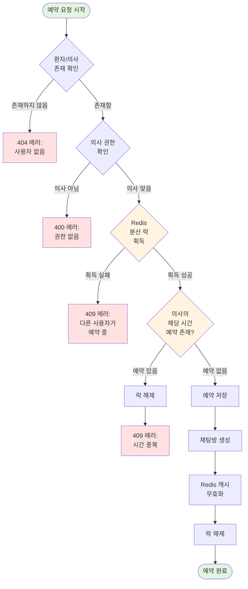

---

## 📊 중복 예약 체크 로직 (Redis 통합)

### 의사 중복 체크 with Redis 분산 락

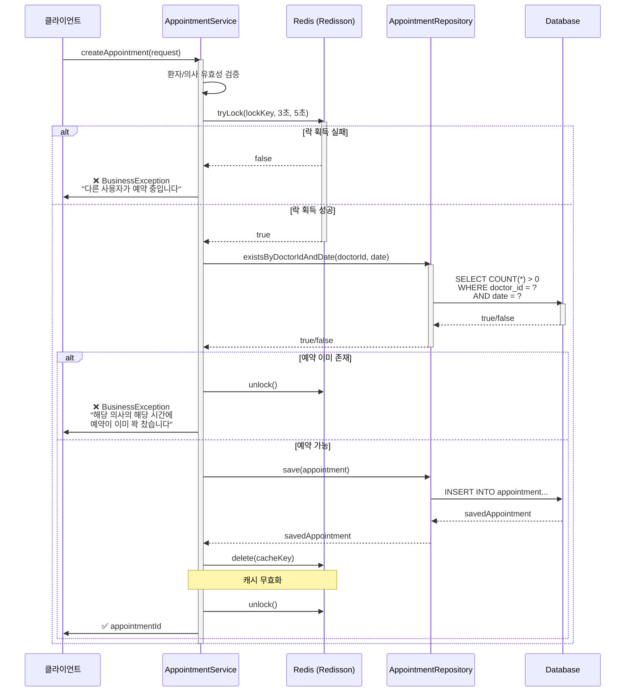

---

## 🏥 다중 진료과 예약 시나리오

### Case: 환자A가 같은 시간에 내과, 외과 예약

```mermaid
gantt
    title 2025-12-18 09:00 예약 타임라인
    dateFormat HH:mm
    axisFormat %H:%M

    section 환자A
    내과 예약 (의사1)    :active, 09:00, 30m
    외과 예약 (의사2)    :active, 09:00, 30m
    피부과 예약 (의사3)  :active, 09:00, 30m

    section 환자B
    내과 예약 시도 (의사1) :crit, 09:00, 30m
```

**설명**:

- ✅ 환자A: 내과(의사1) 09:00 예약 **성공**
- ✅ 환자A: 외과(의사2) 09:00 예약 **성공** (다른 의사)
- ✅ 환자A: 피부과(의사3) 09:00 예약 **성공** (다른 의사)
- ❌ 환자B: 내과(의사1) 09:00 예약 **실패** (의사1 중복)

---

## 🔄 취소된 예약 재예약 시나리오

### Case: 취소된 시간대에 다른 환자가 예약

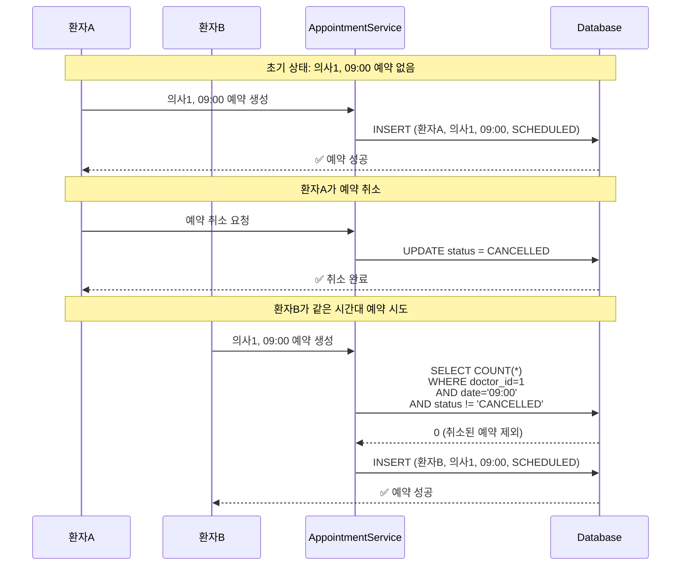

**설명**:

1. 환자A가 의사1의 09:00 시간대 예약 → **성공** (SCHEDULED)
2. 환자A가 예약 취소 → 상태가 **CANCELLED**로 변경
3. 환자B가 같은 시간대(의사1, 09:00) 예약 시도
4. 중복 체크 쿼리에서 `status != 'CANCELLED'` 조건으로 **취소된 예약 제외**
5. 환자B 예약 → **성공** ✅

**중요**:

- 취소된 예약은 다른 진료과와 마찬가지로 **의사별로** 독립적으로 처리됨
- 의사A의 취소 → 의사A의 해당 시간만 재예약 가능
- 의사B, 의사C는 전혀 영향 받지 않음

---

## 🔍 상세 비교: v1.0 vs v2.0

### v1.0 (이전 버전 - 환자 중복 체크 있음)

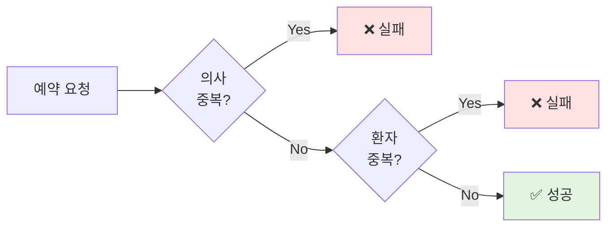

**문제점**: 환자가 같은 시간에 내과 예약 후 외과 예약 시도 시 **실패**

---

### v2.0 (현재 버전 - 환자 중복 체크 제거 + 취소된 예약 처리)

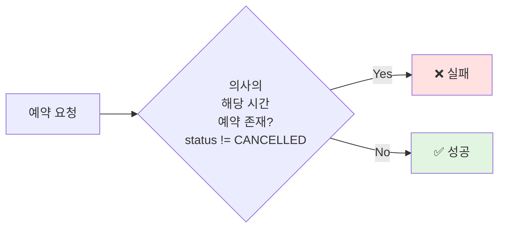

**개선점**:

- 환자가 같은 시간에 여러 진료과 예약 가능 ✅
- 취소된 예약(CANCELLED)은 중복 체크에서 제외되어 같은 시간대 재예약 가능 ✅

---

## 🎯 데이터베이스 제약조건 (권장)

### 유니크 인덱스로 동시성 제어

```sql
-- 의사는 같은 시간에 한 명만 진료 가능
CREATE UNIQUE INDEX idx_appointment_doctor_date_unique
ON appointment(doctor_id, date)
WHERE status != 'CANCELLED';
```

**효과**:

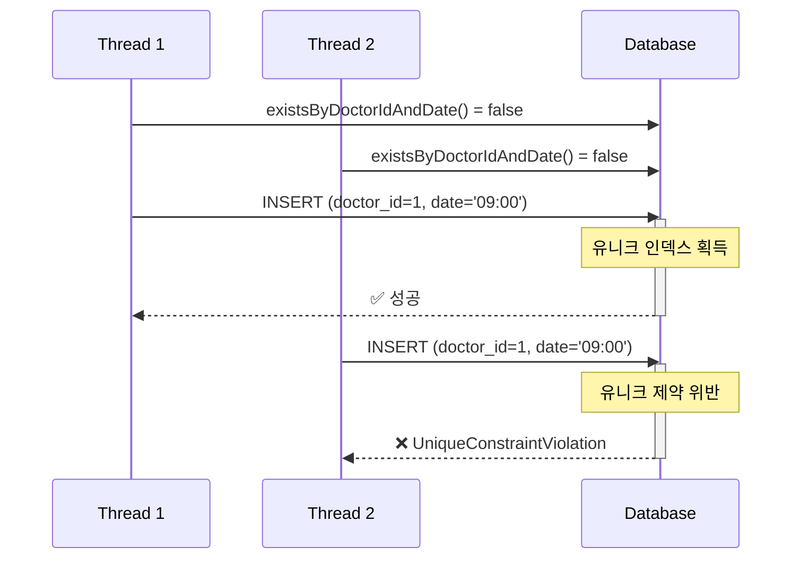

---

## 📈 성능 분석

### 쿼리 실행 계획

```sql
-- existsByDoctorIdAndDate 쿼리
EXPLAIN ANALYZE
SELECT COUNT(*) > 0
FROM appointment
WHERE doctor_id = 21
  AND date = '2025-12-18 09:00:00';
```

**인덱스 있을 때**:

```
Index Scan using idx_appointment_doctor_date
  Cost: 0.43..8.45 rows=1
  Execution Time: 0.023ms
```

**인덱스 없을 때**:

```
Seq Scan on appointment
  Cost: 0.00..1234.56 rows=1
  Execution Time: 45.678ms
```

---

## 🧪 테스트 커버리지

### 테스트 매트릭스

| 시나리오                      | 테스트 파일                      | 결과    |
| ----------------------------- | -------------------------------- | ------- |
| 의사 중복 예약 방지           | AppointmentServiceTest           | ✅ Pass |
| 환자 다중 진료과 예약         | AppointmentDepartmentServiceTest | ✅ Pass |
| 예약된 시간 조회 - 취소 제외  | AppointmentBookingServiceTest    | ✅ Pass |
| 진료과명 자동 설정            | AppointmentDepartmentServiceTest | ✅ Pass |
| 예약 생성 시 채팅방 자동 생성 | AppointmentServiceTest           | ✅ Pass |

---

## ✅ Redis 통합 완료

### 1. Redis 분산 락 (Redisson)

**구현 내용:**

```java
// 락 키 형식: appointment:lock:doctor:{doctorId}:{date}
String lockKey = "appointment:lock:doctor:21:2025-12-18T09:00";
RLock lock = redissonClient.getLock(lockKey);

// 락 획득 시도 (최대 3초 대기, 5초 후 자동 해제)
boolean isLocked = lock.tryLock(3L, 5L, TimeUnit.SECONDS);
```

**효과:**

- 동시 예약 요청 시 순차적으로 처리
- Race Condition 방지
- 자동 락 해제로 데드락 방지

**설정:**

```yaml
# application.yaml
redisson:
  singleServerConfig:
    address: "redis://localhost:6379"
    connectionMinimumIdleSize: 5
    connectionPoolSize: 10
    timeout: 3000
    retryAttempts: 3
    retryInterval: 1500
```

### 2. Redis 캐싱 시스템

**구현 내용:**

```java
// 캐시 키 형식: appointment:booked:{doctorId}:{date}
String cacheKey = "appointment:booked:21:2025-12-18";

// 캐시에서 조회 (5분 TTL)
List<String> cachedTimes = getCachedBookedTimes(cacheKey);

// 캐시 무효화 (예약 생성/취소 시)
invalidateBookedTimesCache(doctorId, date);
```

**효과:**

- DB 조회 횟수 감소 (성능 향상)
- 캐시 TTL 5분으로 데이터 신선도 유지
- 예약 생성/취소 시 즉시 캐시 무효화

**캐시 전략:**

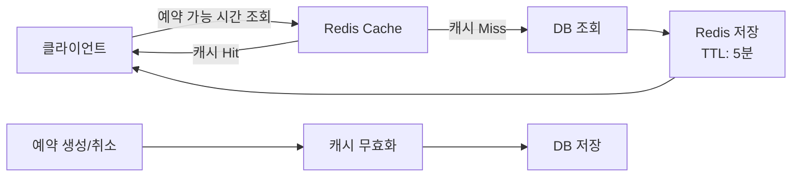

### 3. 동시성 제어 시나리오

**Case: 두 명이 동시에 같은 시간 예약 시도**

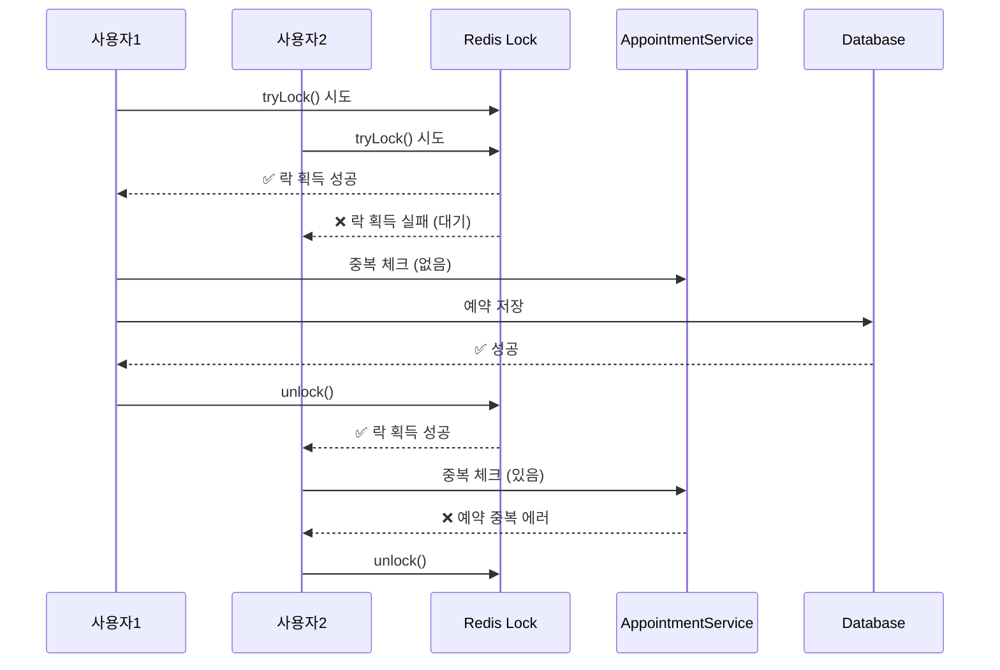

### 4. 테스트 커버리지

**Redis 통합 테스트:**

- ✅ Redis 분산 락을 사용한 예약 생성
- ✅ 락 획득 실패 시 예외 처리
- ✅ Redis 캐시 Hit 시 DB 조회 생략
- ✅ Redis 캐시 Miss 시 DB 조회 및 캐싱
- ✅ 취소된 예약 제외 처리
- ✅ 예약 생성/취소 시 캐시 무효화

**테스트 파일:**

- `AppointmentRedisServiceTest.java` (8개 테스트)

## 🚀 향후 개선 방향

### 1. 예약 대기열 시스템

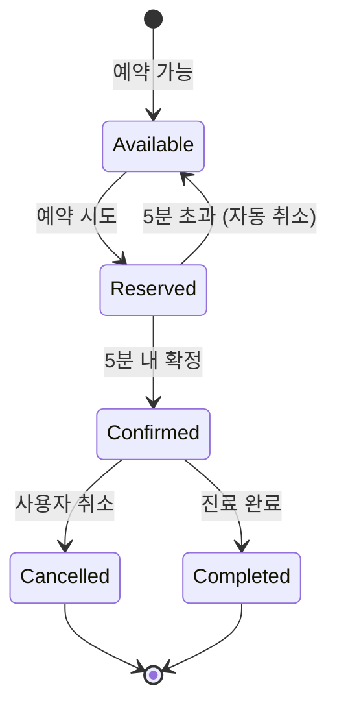

### 3. 예약 충돌 알림

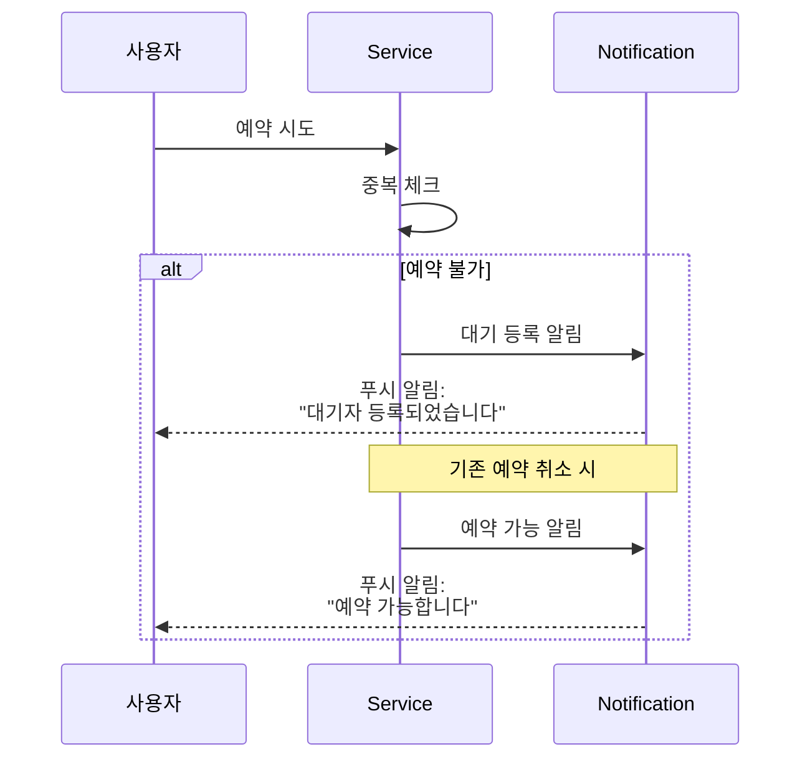

---

## 📚 참고 자료

- [Spring Data JPA Query Methods](https://docs.spring.io/spring-data/jpa/docs/current/reference/html/#jpa.query-methods)
- [Database Indexing Best Practices](https://use-the-index-luke.com/)
- [Pessimistic Locking in JPA](https://www.baeldung.com/jpa-pessimistic-locking)
- [Distributed Locks with Redis](https://redis.io/docs/manual/patterns/distributed-locks/)
